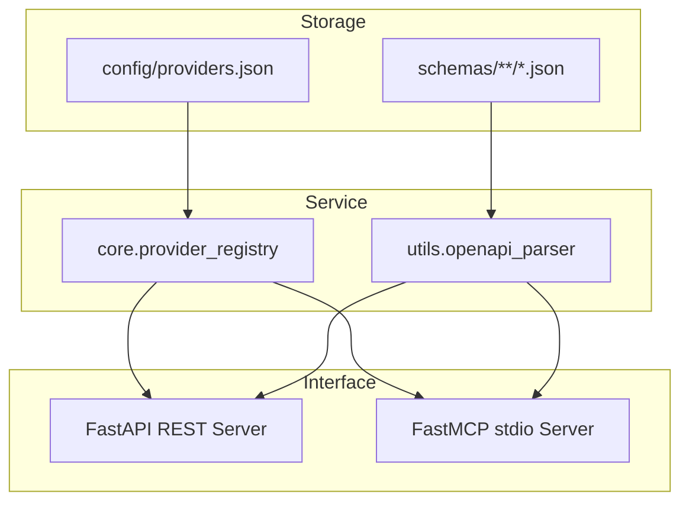

# Architecture: Apina

Apina is designed to act as an offline-first, light-weight agentic registry for OpenAPI specs.

## Data Layer

- **`providers.json`**: Acts as the database. It registers APIs with metadata (e.g. rate limits, category, authentication type, and path to their OpenAPI schema file).
- **`schemas/`**: Stores raw, static OpenAPI schemas in JSON format. This avoids making dynamic fetches to external sites during agent loops.

## Core Logic

- **`provider_registry.py`**: Loads the JSON provider file into memory and serves query requests.
- **`openapi_parser.py`**: Evaluates target OpenAPI schema files and returns unified `EndpointSchema` objects.

## Exposure Layers

- **REST Engine**: FastAPI serves JSON endpoints returning formatted provider structures and parsing endpoint schemas dynamically.
- **MCP Server**: FastMCP exposes `search_api` to search endpoints and their full definitions using keyword parameters.
