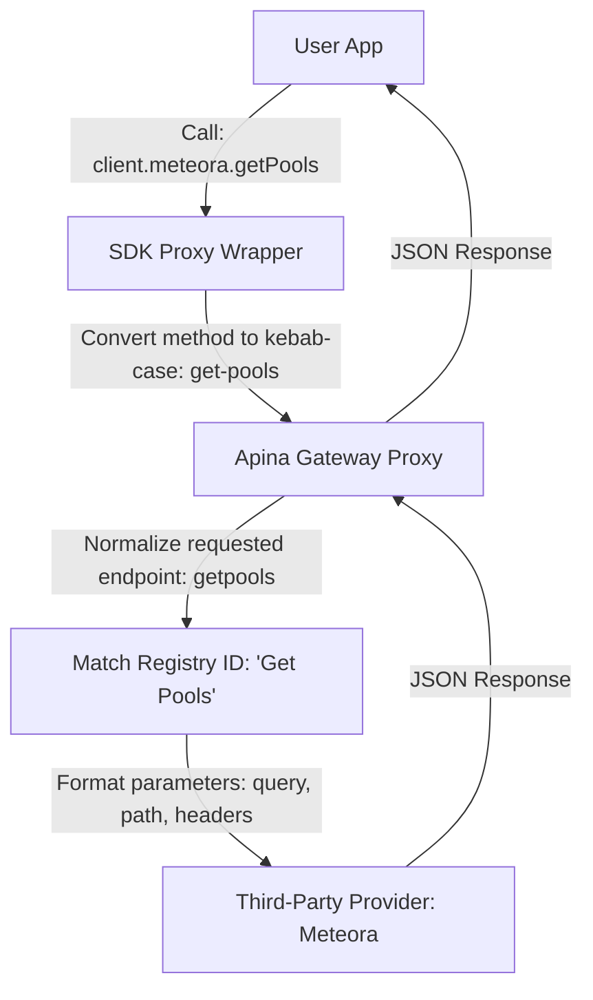

# JavaScript SDK Client Architecture

This document describes the runtime execution flow and architecture of the dynamic, proxy-based JavaScript SDK client.

## Core Concepts

The Apina JS SDK uses a **Dynamic Runtime Proxy** model rather than statically compiling endpoints. This avoids package update overhead when new API providers are added to the registry.

---

## Key Components

### 1. The ES6 Proxy Interceptor

When you invoke `client.meteora.getPools()`, the SDK intercepts the lookup:

- `client.meteora` returns a nested Proxy representing the `meteora` provider.
- `client.meteora.getPools` intercepts the method name, translates it from camelCase to kebab-case (`get-pools`), and returns an async execution function.

### 2. Parameter Normalization & Extraction

The client sends a POST request to `/api/v1/providers/meteora/endpoints/get-pools/call`.
The FastAPI backend:

1. Performs **case-insensitive matching** and strips all underscores, hyphens, and spaces (`getpools` matches `"Get Pools"`).
2. Reads the OpenAPI schema definition for `"Get Pools"`.
3. Separates the user's flat argument object:
   - Path parameters (e.g., `{slug}`) are substituted directly in the URL.
   - Query parameters are appended to the request URL query string.
   - Headers/cookies are attached to the HTTP headers.
4. Executes the HTTP call to the provider using Python `requests` and proxies the response back.
